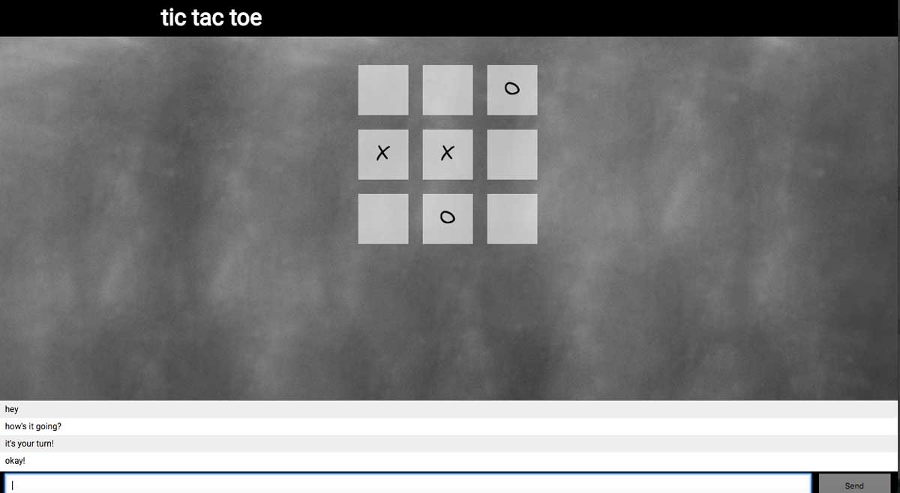

# tic tac toe
Single-page web app that utilizes Angular JS and Web sockets so multiple users can play tic tac toe.



## Technologies Used
* [Angular JS](https://angularjs.org/)
* [Express JS](https://expressjs.com/)
* [Node JS](https://nodejs.org/en/)
* [Socket.io](http://socket.io/)

## Installation
```
npm install
```
## Unsolved Problems/Next Steps
* While working on this application, I decided to simplify things by not using the entire MEAN stack. Moving forward, I would want to tackle using Mongo DB for this.
* Prompting users for their names so their name is printed next to their chat messages.
* Setting X or O to specific users - at the moment a user can play both parts even when two players are connected.
* Deploying the application
